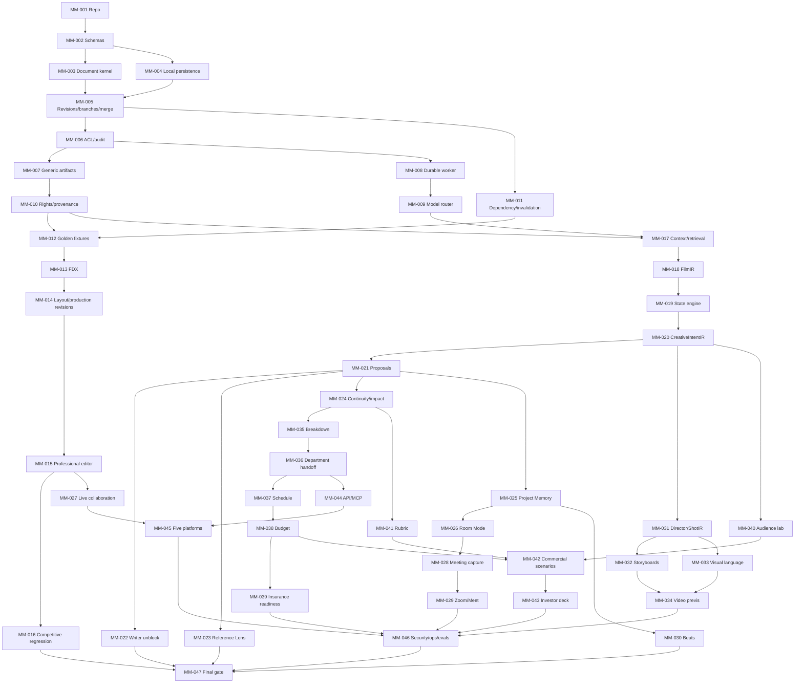

# Movie Muse V2 Dependency Graph

The machine source of truth is `dependency_dag.yaml`. This file is explanatory.

V2.1 strengthened acceptance requirements without changing the 47 node IDs, titles or dependency edges.

## Corrected sequencing invariants

- `MM-009 Model router` is a prerequisite of `MM-017/018` and all later AI generation.
- `MM-012 Golden fixtures` exists before FDX, layout, editor regressions, and AI extraction acceptance.
- `MM-007 Generic artifacts` exists before storyboards, correspondence, insurance packets, and investor decks.
- `MM-035 Breakdown -> MM-037 Schedule -> MM-038 Budget -> MM-039 Insurance readiness` is mandatory.
- `MM-047` depends on every preceding package; it cannot hide an unfinished leaf package.

## Invalidation example

If the typed screenplay schema changes, `MM-002` becomes STALE. The tool computes reverse edges and marks its full dependent closure STALE—including document, revision, layout, FilmIR, production, platform, and final-gate items. Unrelated root tooling may remain PASS if its fingerprint did not change.
